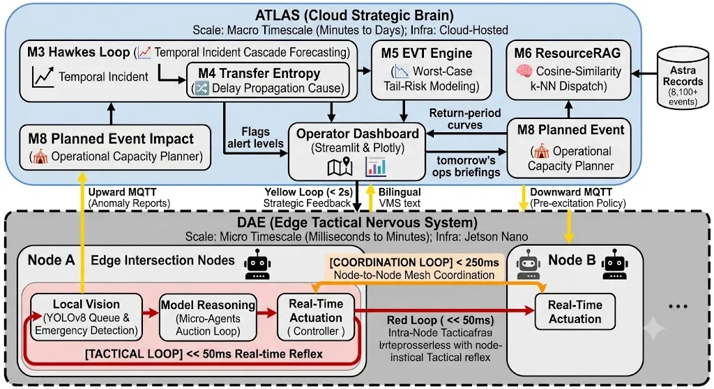

# 🚦 ATLAS & DAE: The Closed-Loop Traffic Intelligence Stack

> **Strategic macro-forecasting meets decentralized micro-signal preemption.**
>
> Live Dashboard (ATLAS): [https://jxryzmpteshsj9nou63kqu.streamlit.app](https://jxryzmpteshsj9nou63kqu.streamlit.app)  
> Live 3D Simulation (DAE): [https://atlas-lzk5n1olh-pranavi-pulluris-projects.vercel.app](https://atlas-lzk5n1olh-pranavi-pulluris-projects.vercel.app)  
> Live Backend API: [https://dae-backend-4w9d.onrender.com/health](https://dae-backend-4w9d.onrender.com/health)

> ⚠️ **Note:** The Render backend (free tier) may take up to 60 seconds to wake from cold start. If ATLAS Screen 11 shows DAE OFFLINE, visit the health endpoint directly and wait 60 seconds, then refresh.

---

## 📦 Dataset & Problem Statement

Built for the **Flipkart GRiD x HackerEarth** hackathon — Problem Statement: **Event-Driven Congestion (Planned & Unplanned)**.

> *Operational Challenge*: Political rallies, festivals, sports events, construction activities, and sudden gatherings create localized traffic breakdowns. Event impact is not quantified in advance, resource deployment is experience-driven, and there is no post-event learning system.

*   **Dataset**: Astram (Bengaluru traffic events) · 8,173 events · Nov 2023 – Apr 2024
*   **Coverage**: 13 monitored corridors · 12 cause types · 94.3% unplanned events (accidents, breakdowns, waterlogging, potholes) · remainder planned events (rallies, festivals, sports, construction)

**Key empirical finding**: Coefficient of Variation (CV) > 1 on every monitored corridor proves traffic incidents are self-exciting (non-Poisson) — clustering and triggering each other rather than occurring independently. This is the mathematical license for modeling congestion with a Hawkes self-exciting process instead of a static average-based approach.

---

## 📖 Overview

ATLAS & DAE is a unified, closed-loop urban traffic management system that bridges long-term planning with instant operational response, directly targeting the three gaps named in the problem statement:

1. **Quantifying impact in advance** — ATLAS's Hawkes Process and EVT models forecast cascade risk and worst-case delay before an incident or planned event escalates.
2. **Replacing experience-driven deployment** — The Event Simulator (M8) and Dispatch Recommender (M6) translate event/incident parameters into specific officer counts, barricade counts, diversion routes, and resolution-time estimates.
3. **Closing the post-event learning loop** — Each resolved incident is designed to feed back into the historical pool the Dispatch Recommender draws on, so the system improves with use.

The stack has two layers:

1. **ATLAS (Strategic Layer)**: An 11-screen Streamlit command dashboard for municipal dispatchers, running a 9-module analytical pipeline (M0–M8, detailed below) covering preprocessing, clustering, causal mapping, cascade forecasting, tail-risk modeling, dispatch recommendation, calibration, and planned-event simulation.
2. **DAE (Tactical Layer)**: A decentralized edge intelligence layer with real-time YOLOv8 vision, per-lane micro-agents, and an LLM master agent that runs a starvation-guarded auction for green-light priority — visualized via a React/Next.js + Three.js 3D simulation, with MQTT-based preemption establishing green-wave corridors for emergency vehicles.

---

## 🏗️ Hybrid Architecture: ATLAS & DAE Closed-Loop Stack

The system splits into a **Strategic Cloud Brain (ATLAS)** and a **Decentralized Tactical Edge (DAE)**, cooperating in a closed feedback loop linked via MQTT.



### 1. ATLAS (Cloud Strategic Brain)

Operates on a macro timescale (minutes to days) as the analytical and administrative layer for human dispatchers and city planners.

*   **Operator Dashboard** (Streamlit & Plotly): real-time risk-colored corridor maps, CLEAR (clearance savings) economic metrics, next-day ops briefings, and side-by-side corridor "DNA" comparisons.
*   **Cascade Forecasting Loop** (M3 Hawkes & M4 Transfer Entropy): evaluates background rates and excitation indices per corridor; flags alert levels when branching ratio $n \ge 0.25$ or when Transfer Entropy reveals downstream delay propagation between corridors.
*   **Worst-Case Tail Planner** (M5 EVT): fits a Generalized Pareto Distribution on extreme congestion delays to calculate return periods and size manpower/asset buffers (tow trucks, officers) for extreme spikes.
*   **Nearest-Neighbour Dispatcher** (M6): encodes active incidents as 12-dimensional vectors, runs k-NN cosine-similarity search over historical records, and outputs dispatch priority, expected clearance time with IQR range, road-closure recommendation, and auto-generated bilingual radio scripts.

### 2. DAE (Edge Tactical Nervous System)

Operates on a micro timescale (milliseconds to minutes) via a decentralized network of autonomous intersection controllers.

*   **Local Vision Processing**: edge object detection (YOLOv8) counts vehicle queues, distinguishes vehicle types, and detects approaching emergency vehicles.
*   **Lane Agents**: each approach (N/S/E/W) is a micro-agent calculating its own demand utility from queue density, wait time, and emergency priority.
*   **LLM Master Agent**: a lightweight local LLM orchestrates lane negotiations, reviewing utility bids and selecting the phase winner via a starvation-guarded auction algorithm.
*   **Real-Time Actuation**: switches physical signal phases dynamically, minimizing wait times while preventing starvation loops.
*   **Inter-Intersection Mesh (A2A)**: adjacent nodes exchange peer-to-peer messages — e.g. Node A green-lighting a heavy westbound queue warns Node B to prepare its timing for the oncoming surge.

### 3. Data Flows & Latency Constraints

| Loop | Path | Latency Constraint |
|---|---|---|
| **Tactical** (intra-node) | YOLOv8 Detection → Lane Agent Utility → LLM Auction → Signal Actuation | < 50ms (benchmarked at **42ms on Jetson Nano**) |
| **Coordination** (node-to-node) | Node A State Transition → A2A MQTT Message → Node B Preemption | < 250ms |
| **Strategic** (edge-to-cloud) | DAE Edge Anomaly → MQTT → ATLAS Hawkes Recalculation → Dispatcher Alert / Pre-Excitation Policy | < 2s |

*   **Upward Flow**: Edge cameras detect abnormal traffic buildup or emergency vehicles and publish alerts via MQTT. ATLAS processes the telemetry to update corridor risk profiles and dispatch suggestions.
*   **Downward Flow**: When ATLAS predicts network stress from an upcoming planned event, it pushes pre-excitation policies to DAE nodes via MQTT, prompting signal-priority adjustments ahead of the surge.

---

## 🔌 Live Deployment Components

| Component | Cloud Platform | URL | Role & Description |
|---|---|---|---|
| **ATLAS Dashboard** | Streamlit Cloud | [Link](https://jxryzmpteshsj9nou63kqu.streamlit.app) | **Strategic Layer**: 11-screen app running the full M0–M8 pipeline. |
| **DAE 3D Simulation** | Vercel | [Link](https://atlas-lzk5n1olh-pranavi-pulluris-projects.vercel.app) | **Tactical Layer**: Real-time 3D simulation of decentralized signal control and ambulance preemption. |
| **DAE Backend API** | Render (Docker) | [Link](https://dae-backend-4w9d.onrender.com/health) | **API Layer**: FastAPI backend running LangChain agents, simulation loops, and CORS. |

---

## ⏱️ Quick Demo Flow

*   **00:00** — Open **ATLAS → Screen 11 (🔌 DAE Integration)**. Confirm DAE status reads **ONLINE** (wait for Render to wake up if offline), displaying live Hawkes branching ratio $n \approx 0.22$ on Mysore Road.
*   **00:10** — Open the **DAE 3D Simulation** page in a separate window, select route `A → B → D`, and click **Deploy Ambulance**.
*   **00:20** — Watch the green wave propagate across nodes A, B, and D in real-time 3D, prioritizing the ambulance approach and returning to normal control after it passes.
*   **00:35** — Return to **ATLAS Screen 11**. The live telemetry card captures the active ambulance status, current node green phases, wait times, and the live agent reasoning history.

---

## 🛠️ Local Installation & Running

### Option A: Running Locally (Fastest)

Open three separate terminal windows:

#### 1. DAE Backend (FastAPI)
```bash
cd dae/traffic_agent
pip install -r requirements.txt
uvicorn main:app --reload --port 8000
```

#### 2. DAE Frontend (Next.js)
```bash
cd dae/public
npm install
npm run dev
```

#### 3. ATLAS Dashboard (Streamlit)
```bash
pip install -r requirements.txt
streamlit run dashboard/app.py
```

### Option B: Running with Docker Compose
```bash
docker compose up --build
```
*   **ATLAS Dashboard**: `http://localhost:8501`
*   **DAE Frontend**: `http://localhost:3000`
*   **DAE Backend**: `http://localhost:8000`

---

## 📊 Analytical & Modeling Core (M0–M8)

### M0: Preprocessing & Classification Pipeline (`m0_pipeline.py`)
The foundation data engine. Standardizes timestamps to IST, imputes missing attributes (e.g. dominant vehicle type), cleans corridor names, filters events outside monitored zones, maps spatial coordinates, and classifies incidents as **Acute** (sudden, transient — breakdowns, accidents) or **Chronic** (persistent infrastructure issues — potholes, waterlogging).

### M1: EM Gaussian Mixture Model (`m1_em_mixture.py`)
Fits an Expectation-Maximization Gaussian Mixture Model on temporal features and event-duration distributions to decouple the overlapping density signatures of acute vs. chronic events, assigning cluster-membership probabilities so the system can separate structural bottlenecks from random accidents.

### M2: Causal Cause Network (`m2_cause_graph.py`)
Calculates empirical conditional transition probabilities between sequential events at adjacent nodes, constructing a directed cause graph showing how a chronic issue (e.g. waterlogging) propagates into downstream acute issues (e.g. collisions). Merges static baseline co-occurrence limits with live dataset values to build the causal link matrix.

### M3: Hawkes Self-Exciting Point Process (`m3_hawkes.py`)
Models incidents as a self-exciting point process:
$$\lambda(t) = \mu + \alpha \sum_{t_i < t} e^{-\beta(t - t_i)}$$
Fits background rates ($\mu_{day}, \mu_{night}$), excitation weight ($\alpha$), and decay ($\beta$) per corridor via maximum likelihood. Yields branching ratio $n = \alpha/\beta$ — the average number of secondary cascades triggered by one event. A corridor is flagged **CASCADE_RISK** when $n \ge 0.25$.

### M4: Information-Theoretic Transfer Entropy (`m4_transfer_entropy.py`)
Computes non-linear, directional information transfer between corridors using joint and conditional Shannon entropies over time-lagged incident bins, determining whether delays on Corridor A statistically cause subsequent delays on Corridor B — filtering out coincidental synchrony to leave only true causal edges.

### M5: Extreme Value Theory (EVT) Engine (`m5_evt.py`)
Fits a Generalized Pareto Distribution via peak-over-threshold methods on the extreme tail of clearance delays:
$$G(x; \sigma, \xi) = 1 - \left(1 + \frac{\xi x}{\sigma}\right)^{-1/\xi}$$
Outputs tail shape ($\xi$), scale ($\sigma$), and return-period curves (e.g. predicted size of a 100-hour extreme delay event) to size defensive resource buffers.

### M6: Nearest-Neighbour Dispatch Recommender (`m6_resource_rag.py`)
Encodes an active incident as a 12-dimensional feature vector (cause, corridor, priority, vehicle type, hour, day, month, etc.) and runs a cosine-similarity k-NN search ($k=5$) over 3,139 closed Astram records, filtered by a resolution-quality score (favoring cases cleared quickly). Outputs expected resolution time with IQR bounds, road-closure recommendation, and a bilingual (Kannada/English) radio script.

### M7: Model Calibrator (`m7_calibrator.py`)
Backtests and validates pipeline predictions against observed outcomes in the dataset, computing Mean Absolute Error (MAE) to quantify how much the ATLAS models improve over static baseline averages.

### M8: Planned Event Impact Simulator (`m8_event_simulator.py`)
Simulates the traffic footprint of future planned events (cricket matches, rallies, festivals, construction). Translates event parameters (venue, time, crowd size) into surge multipliers, then dynamically scales officer and barricade requirements based on crowd size and event type:
```python
scale = max(1.0, crowd_size / 10_000)
officers   = int(params["base_officers"]   * min(scale, 4))
barricades = int(params["base_barricades"] * min(scale, 3.5))
```
Also computes diversion routes mapped to venue/crowd thresholds and generates formatted text broadcasts for digital Variable Message Signs (VMS).

---

## 📄 Prior Research

The DAE tactical layer builds on our own ongoing research:
*"Decentralized Agentic Edge Traffic Management System for Predictive Emergency Preemption"* (currently under peer review - attached in repo)

Results below were benchmarked on physical Jetson Nano hardware as part of this research:
*   **42ms** latency (tactical signal-control loop)
*   **93%** emergency vehicle delay reduction
*   **24.5%** civilian wait time reduction

> Note: paper is under review; results reflect our own internal testing and will be updated with a link once published. This submission is a software-only online demo (live links above); a physical Raspberry Pi rig is available for in-person demonstration but is not part of this submission.
